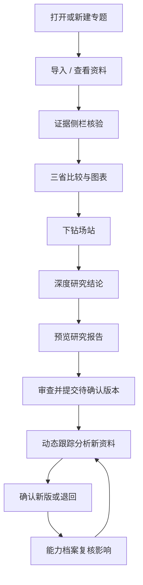

本文已被更完整的白话说明取代，请改读：**观澜-用户使用流程与系统讲解-v1.md**。现场口播见 **观澜-演示路径-演讲稿-v1.md**。

观澜是新能源场站配套储能的产业情报与决策研究工作台。给战略研究、投资发展、场站技术和业务负责人做**区域优先研究**和**单场站配储论证**，不自动批准投资。

演示地址：https://guanlan.maybe404.com  
演示账号：界面固定为「演示账号 · 张远（战略研究）」。数据是混合包：三省政策/电价为真实公开口径，场站内部访谈与部分运行数据为明确标注的模拟。

## 用户怎么走

顶部不再放演示进度条。现场按《观澜-演示路径-演讲稿-v1》走：专题 → 资料 → 核验 → 比较 → 场站 → 研究 → 报告 → 审查 → 更新。

## 各页做什么

| 页面 | 看到什么 | 能做什么 |
|---|---|---|
| 业务专题 | 研究问题、范围、版本、缺口 | 沿编号按钮进入后续环节；空专题可「载入演示资料包」 |
| 情报资料 | 资料表、信源检查 | 导入粘贴文本；点行看原文；点事实核验 |
| 区域比较 | 七维表、雷达、N/V、供需 | 点省份对照；点场站看配储参数 |
| 深度研究 | 四档建议、三层结论、配置方向、行动 | 点资料编号追溯；去报告审查 |
| 报告审查 | 封面、摘要、图表要点、审查意见 | 提交审查或退回草稿 |
| 动态跟踪 | 预生成影响链路、版本历史 | 分析新增资料、确认 v1.5 |
| 企业能力档案 | 五组能力字段 | 模拟编辑后看受影响结论 |

专题只在左侧「当前专题」切换。换专题会换资料和结论，不会把上一专题判断带过来。

## 现场 8 分钟建议口播

打开苏浙粤专题 → 比较页讲江苏优先、广东有必要条件缺口 → 点如东场站讲 45MW/90MWh/2h → 研究页点 M-010 追电价原文 → 报告页给领导看摘要 → 动态跟踪导入新政、确认前旧版仍有效 → 切如东专题证明工作台隔离。
